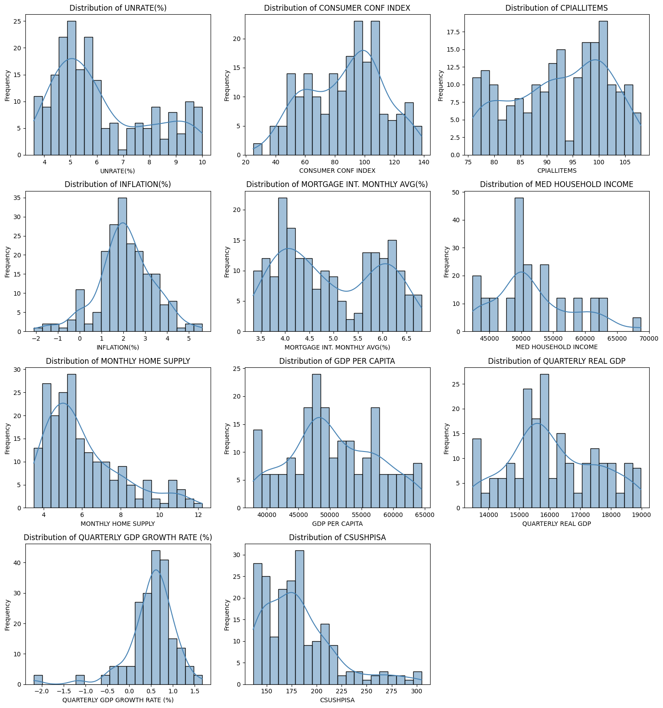
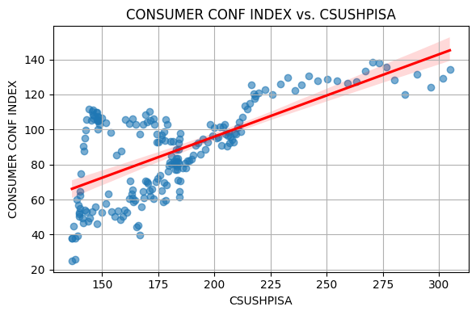
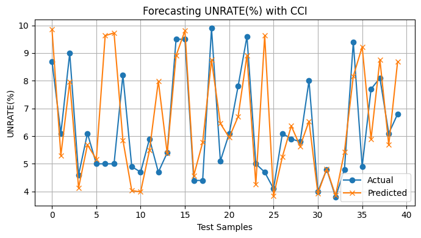

# Consumer Confidence Index & Key Economic Indicator EDA

### **Project Links**
Link to Kaggle Data Set: https://www.kaggle.com/datasets/sagarvarandekar/macroeconomic-factors-affecting-us-housing-prices

Link to Interactive Colab Notebook: [Colab Link: Jupyter Notebook](https://colab.research.google.com/drive/19OQg3i31eW9riXzYHS99ohoML-Kr_TGU#scrollTo=cKZvO69tHc3d&uniqifier=1)

Link to README .io Webpage: https://fujipy.github.io/CCI-and-Key-Economic-Indicators/

Link to Youtube Colab Walkthrough: https://www.youtube.com/watch?v=Zklkcrchbu0

Link to Youtube Project Presentation: https://youtu.be/no8bqrgP5WA 


### **Data Set Info:**

Source: Kaggle Data Set compiled from FRED official website, demographic data from OECD and Consumer Confidence Index from Conference Board.

Author: Sagar Varandekar

Period: 05/2002 - 05/2022 (2019-01)

Collection Frequencies: Monthly and/or Quarterly

------------------------------------------------------------------------
## Index:

-  Kaggle Source Data Info & Link
  
- **[Business Understanding](https://github.com/FujiPy/CCI-and-Key-Economic-Indicators/blob/main/CCIMarkdown.md#business-understanding)**


    -   Background

        -   Economic Indicators & Business Cycle

        -   Consumer Confidence Index
          
    -   Project Objectives
 

-   **[Data Overview & Understanding](https://github.com/FujiPy/CCI-and-Key-Economic-Indicators/blob/main/CCIMarkdown.md#data-overview--understanding)**

    -   Import Data Set
      
    -   Data Set Basics & Structure

    -   Key Variables/Columns
      
    -   Variable Breakdown & More Info

    -   Summary Statistics 

-   **[Data Preperation](https://github.com/FujiPy/CCI-and-Key-Economic-Indicators/blob/main/CCIMarkdown.md#data-preparation)**

    -   Data Set Notes
      
    -    Reorganize
 
    -   Missing Data & Cleaning
 
    -   Summary Statistics
 
    -   Visualize & Analyze Distributions & Correlations

    -   Distribution Assumptions
          
    -   Final Model Adjustments & Notes
      

-   **[Machine Learning Models & Performance](https://github.com/FujiPy/CCI-and-Key-Economic-Indicators/blob/main/CCIMarkdown.md#modeling--evaluation)**
    -   Model Descriptions
      
    -   Regression Models with CCI as Target

    -   Random Forest Model with CCI as Target

           - Feature Importance 

    -   Random Forest Model for CCI as forecaster
        
-   **[Evauations, Conclusions, & Findings](https://github.com/FujiPy/CCI-and-Key-Economic-Indicators/blob/main/CCIMarkdown.md#conclusions)**

    -   Notes on Performance Metrics

    -   Conclusions
    
    -   Final Insights
      
-   **[Business Applications](https://github.com/FujiPy/CCI-and-Key-Economic-Indicators/blob/main/CCIMarkdown.md#business-application)**
  
-   **[Next Steps & Potential Continuations](https://github.com/FujiPy/CCI-and-Key-Economic-Indicators/blob/main/CCIMarkdown.md#next-steps--continuations)**

-   **[Inquiries](https://github.com/FujiPy/CCI-and-Key-Economic-Indicators/blob/main/CCIMarkdown.md#Inquiries)**

------------------------------------------------------------------------

# Business Understanding

Target Variable: Consumer Confidence Index (CCI)

## **Background:**
**Relevant Educational Links: (Investopedia)**

Business Cycle: https://www.investopedia.com/terms/b/businesscycle.asp

Monetary Policy: https://www.investopedia.com/terms/m/monetarypolicy.asp

Economic Indicators: https://www.investopedia.com/terms/e/economic_indicator.asp

Link to The Conference Board CCI Webpage: https://www.conference-board.org/topics/consumer-confidence

**Macroeconomic Indicators:**

Macroeconomic indicators are highly interactive and nonlinear, especially due to the cyclical nature of the business cycle and monetary policy. They often influence each other in complex and dynamic ways, with feedback loops that unfold over time. For example, rising inflation may be correlated with high wage and GDP growth which is positive for Consumer Sentiment Short term, but can lead to tighter monetary policy (higher interest rates or quantitative tightening), which in turn may negatively affect consumer behavior, investment, business performance, unemployment, wages, and ultimately consumer sentiment over a longer, but still (hopefully!) limited time frame.


**Consumer Confidence Index:**

The Consumer Confidence Index (CCI) is a widely used gauge of how optimistic or pessimistic consumers are regarding the health of the economy, based on their perceptions of current conditions and expectations for the next six months. It is calculated by The Conference Board using monthly survey data from 5,000 U.S. households. Respondents are asked about current business and labor market conditions, as well as expectations for six months ahead regarding business, employment, and income. The CCI can indicate how willing consumers are to make purchases and how willing firms may be to invest.


This makes CCI a leading indicator: it often shifts in advance of changes in the business cycle, reflecting expectations of future events or conditons. However, it is also influenced by coincident indicators like employment and income, creating a feedback structure that is difficult to model with simple linear tools. Hence, understanding CCI requires an appreciation of both its behavioral nature (based on expectations) and its entanglement with broader macroeconomic dynamics.

## **Objectives:**


There are two objectives for this project:

1.) **Modeling Perception of Economic Conditions (CCI) as a function of past and current economic reality (using economic indicators as metrics).** How closely does consumer sentiment align with past and current indicator values? We will explore how well the U.S. Consumer Confidence Index (CCI) correlates to actual economic conditions like GDP per capita, inflation, and unemployment. We will then aim to build a polynomial regression-based machine learning model that interprets the influence of economic indicators in determining CCI (ie. how strongly do other indicators reflect the CCI data).


2.) **Use CCI as a leading and forecasting indicator to predict future economic conditions (using economic indicators as metrics).** Intuitively we seek to determine if CCI is an accurate depiction of future Economic Conditions in the United States. We will use a Random Forest Machine Learning model for this task, and compare model predictions to actual lagged (future) results.


# Data Overview & Understanding

## Import Data Set: Shape, Columns, & Head
```python


import pandas as pd

df = pd.read_csv('/content/US_MACRO_DATA.csv')

df = df.drop(columns=['% SHARE OF WORKING POPULATION','CORP. BOND YIELD(%)', 'PPI-CONST MAT.'])

print(f"Data frame Shape: {df.shape}\n\n")

print(f"Data frame Columns: {df.columns}\n\n")

print(df.head())


```

    Data frame Shape: (241, 12)
    
    
    Data frame Columns: Index(['DATE', 'UNRATE(%)', 'CONSUMER CONF INDEX', 'CPIALLITEMS',
           'INFLATION(%)', 'MORTGAGE INT. MONTHLY AVG(%)', 'MED HOUSEHOLD INCOME',
           'MONTHLY HOME SUPPLY', 'GDP PER CAPITA', 'QUARTERLY REAL GDP',
           'QUARTERLY GDP GROWTH RATE (%)', 'CSUSHPISA'],
          dtype='object')
    
    
             DATE  UNRATE(%)  CONSUMER CONF INDEX  CPIALLITEMS  INFLATION(%)  \
    0  01-05-2022        3.6                106.4   123.322800      8.581511   
    1  01-04-2022        3.6                107.3   121.978170      8.258629   
    2  01-03-2022        3.6                107.2   121.301004      8.542456   
    3  01-02-2022        3.8                110.5   119.702806      7.871064   
    4  01-01-2022        4.0                113.8   118.619339      7.479872   
    
       MORTGAGE INT. MONTHLY AVG(%)  MED HOUSEHOLD INCOME  MONTHLY HOME SUPPLY  \
    0                        5.2300                   NaN                  8.4   
    1                        4.9825                   NaN                  8.4   
    2                        4.1720                   NaN                  7.0   
    3                        3.7625                   NaN                  6.0   
    4                        3.4450                   NaN                  5.7   
    
       GDP PER CAPITA  QUARTERLY REAL GDP  QUARTERLY GDP GROWTH RATE (%)  \
    0           74737           19699.465                      -0.144227   
    1           74737           19699.465                      -0.144227   
    2           73289           19727.918                      -0.395692   
    3           73289           19727.918                      -0.395692   
    4           73289           19727.918                      -0.395692   
    
       CSUSHPISA  
    0    120.724  
    1    121.813  
    2    122.888  
    3    123.831  
    4    124.780  

------------------------------------------------------------------------

## **Variable Breakdown & More Information:**

| Attribute Name | Data Type | Unit of Measure | Type of Economic Indicator | Collection Frequency |
|----------------|--------------|--------------|--------------|--------------|
| DATE | Numeric, Interval | DateTime (yyyy-dd-mm) | N/A | Monthly |
| UNRATE(%) | Numeric, Ratio | Percent (%) | Lagging | Monthly |
| MONTHLY HOME SUPPLY | Numeric, Ratio | Months | Leading | Monthly |
| MORTGAGE INT. MONTHLY AVG(%) | Numeric, Ratio | Percent (%) | Leading? | Monthly |
| CSUSHPISA | Numeric, Interval | Index Value | Lagging | Monthly |
| MED HOUSEHOLD INCOME | Numeric, Ratio | USD (\$) | Coincident | Monthly |
| GDP PER CAPITA | Numeric, Ratio | USD (\$) | Coincident | Quarterly |
| QUARTERLY REAL GDP | Numeric, Ratio | USD (\$ Billions) | Coincident | Quarterly |
| QUARTERLY REAL GDP GROWTH RATE (%) | Numeric, Ratio | Percent (%) | Coincident | Quarterly |
| CPI ALL Items | Numeric, Interval | Index Value | Lagging | Monthly |
| INFLATION(%) | Numeric, Ratio | Percent (%) | Lagging | Monthly |
| CONSUMER CONF INDEX | Numeric, Interval | Index Value | Leading | Monthly |

------------------------------------------------------------------------
## Summary Statistics: Data Set Pre-cleaning & Preperation (Transposed)
```python

df.select_dtypes(include='number').describe().T.round(2)
```


  <div id="df-841a2814-3e06-4aa0-aa67-756a24b11d80" class="colab-df-container">
    <div>

<table border="1" class="dataframe">
  <thead>
    <tr style="text-align: right;">
      <th></th>
      <th>count</th>
      <th>mean</th>
      <th>std</th>
      <th>min</th>
      <th>25%</th>
      <th>50%</th>
      <th>75%</th>
      <th>max</th>
    </tr>
  </thead>
  <tbody>
    <tr>
      <th>UNRATE(%)</th>
      <td>241.0</td>
      <td>6.07</td>
      <td>1.99</td>
      <td>3.50</td>
      <td>4.70</td>
      <td>5.60</td>
      <td>7.30</td>
      <td>14.70</td>
    </tr>
    <tr>
      <th>CONSUMER CONF INDEX</th>
      <td>241.0</td>
      <td>90.81</td>
      <td>25.87</td>
      <td>25.00</td>
      <td>70.40</td>
      <td>94.50</td>
      <td>108.20</td>
      <td>138.40</td>
    </tr>
    <tr>
      <th>CPIALLITEMS</th>
      <td>241.0</td>
      <td>95.54</td>
      <td>11.09</td>
      <td>75.86</td>
      <td>87.72</td>
      <td>96.82</td>
      <td>103.26</td>
      <td>123.32</td>
    </tr>
    <tr>
      <th>INFLATION(%)</th>
      <td>241.0</td>
      <td>2.30</td>
      <td>1.64</td>
      <td>-2.10</td>
      <td>1.46</td>
      <td>2.07</td>
      <td>2.97</td>
      <td>8.58</td>
    </tr>
    <tr>
      <th>MORTGAGE INT. MONTHLY AVG(%)</th>
      <td>241.0</td>
      <td>4.70</td>
      <td>1.12</td>
      <td>2.68</td>
      <td>3.80</td>
      <td>4.46</td>
      <td>5.81</td>
      <td>6.81</td>
    </tr>
    <tr>
      <th>MED HOUSEHOLD INCOME</th>
      <td>224.0</td>
      <td>53273.98</td>
      <td>7475.32</td>
      <td>42409.00</td>
      <td>49007.25</td>
      <td>50303.00</td>
      <td>59039.00</td>
      <td>68703.00</td>
    </tr>
    <tr>
      <th>MONTHLY HOME SUPPLY</th>
      <td>241.0</td>
      <td>5.97</td>
      <td>1.90</td>
      <td>3.30</td>
      <td>4.60</td>
      <td>5.50</td>
      <td>6.70</td>
      <td>12.20</td>
    </tr>
    <tr>
      <th>GDP PER CAPITA</th>
      <td>241.0</td>
      <td>52896.08</td>
      <td>8840.59</td>
      <td>37860.00</td>
      <td>46977.00</td>
      <td>51554.00</td>
      <td>58745.00</td>
      <td>74737.00</td>
    </tr>
    <tr>
      <th>QUARTERLY REAL GDP</th>
      <td>241.0</td>
      <td>16536.01</td>
      <td>1708.44</td>
      <td>13477.36</td>
      <td>15304.52</td>
      <td>16253.73</td>
      <td>17896.62</td>
      <td>19806.29</td>
    </tr>
    <tr>
      <th>QUARTERLY GDP GROWTH RATE (%)</th>
      <td>241.0</td>
      <td>0.49</td>
      <td>1.45</td>
      <td>-8.94</td>
      <td>0.29</td>
      <td>0.58</td>
      <td>0.83</td>
      <td>7.55</td>
    </tr>
    <tr>
      <th>CSUSHPISA</th>
      <td>241.0</td>
      <td>175.31</td>
      <td>36.78</td>
      <td>120.72</td>
      <td>147.40</td>
      <td>169.81</td>
      <td>189.71</td>
      <td>304.83</td>
    </tr>
  </tbody>
</table>
</div>
    <div class="colab-df-buttons">

  <div class="colab-df-container">
    <button class="colab-df-convert" onclick="convertToInteractive('df-841a2814-3e06-4aa0-aa67-756a24b11d80')"
            title="Convert this dataframe to an interactive table."
            style="display:none;">

  <svg xmlns="http://www.w3.org/2000/svg" height="24px" viewBox="0 -960 960 960">
    <path d="M120-120v-720h720v720H120Zm60-500h600v-160H180v160Zm220 220h160v-160H400v160Zm0 220h160v-160H400v160ZM180-400h160v-160H180v160Zm440 0h160v-160H620v160ZM180-180h160v-160H180v160Zm440 0h160v-160H620v160Z"/>
  </svg>
    </button>


## Date-Time Variable Interval

```python
import pandas as pd
min_date = pd.to_datetime(df['DATE']).min()
max_date = pd.to_datetime(df['DATE']).max()

print(f"Minimum date: {min_date}")
print(f"Maximum date: {max_date}")
```


(Minimum date: 2002-01-05 00:00:00)
(Maximum date: 2022-01-05 00:00:00)


# Data Preparation

# Data Set Notes:

**Data Set Structure:**
There are 15 columns and 242 rows (or months of data) entered.

**Missing Data:**

There are 17 clear missing values in the Med Household Income Column.

Upon inspection these values were not updated for 2021 and 2022 so we will exclude any values (rows) from dates after 5/2020

**Quarterly Data Points:**

Quarterly Data points such as 'Quarterly Real GDP' and 'Quarterly Real GDP Growth Rate' are considered static across all three months after record until updated the first month of the next quarter.

**Steps to Clean & Prepare Data:**

1.) Flip dataset so dates are chronological

2.) Handle Missing Values

3.) Remove Data affected by Early Covid-19 Pandemic Shocks

4.) Flip Shiller-Home Price Index Values (reversed)

5.) Summary Statistics with Cleaned Data Set

6.) Visualize Distributions

7.) Check Distribution Assumptions
* Normality (check for skew or non-normal distribution)
* Linearity (check for linear relationships)
* Correlations (check correlations between variables)
* Heteroskedasticity (distribution of residuals)

8.) Check for Outliers

9.) Standardize, One-hot Encode, and Transform?

# 1.) Reorganize Data Set Rows Chronologically

## Flip Data Set so Dates Progress from earliest to most recent
```python
df = df.iloc[::-1].reset_index(drop=True)
print(df.head())

```

             DATE  UNRATE(%)  CONSUMER CONF INDEX  CPIALLITEMS  INFLATION(%)  \
    0  01-05-2002        5.8                108.5    75.859538      1.181767   
    1  01-06-2002        5.8                110.3    75.901729      1.067416   
    2  01-07-2002        5.8                106.3    75.986111      1.464789   
    3  01-08-2002        5.7                 97.4    76.239257      1.802817   
    4  01-09-2002        5.7                 94.5    76.365830      1.514302   
    
       MORTGAGE INT. MONTHLY AVG(%)  MED HOUSEHOLD INCOME  MONTHLY HOME SUPPLY  \
    0                        6.8060               42409.0                  4.0   
    1                        6.6500               42409.0                  4.2   
    2                        6.4850               42409.0                  4.2   
    3                        6.2900               42409.0                  4.0   
    4                        6.0925               42409.0                  3.9   
    
       GDP PER CAPITA  QUARTERLY REAL GDP  QUARTERLY GDP GROWTH RATE (%)  \
    0           37860           13477.356                       0.615502   
    1           37860           13477.356                       0.615502   
    2           38099           13531.741                       0.403529   
    3           38099           13531.741                       0.403529   
    4           38099           13531.741                       0.403529   
    
       CSUSHPISA  
    0    304.831  
    1    301.704  
    2    296.496  
    3    290.371  
    4    284.767  


# 2.) Check For and Remove Missing Data

## Check for Missing Values & Heatmap
```python
import seaborn as sns
import matplotlib.pyplot as plt

# Check for missing values
df.isnull().sum()

# Visualize missing values
sns.heatmap(df.isnull(), cbar=False)
plt.title("Missing Values Heatmap")
plt.show()

```


    

    


## Missing values Shown Chronologically by month
```python
import pandas as pd

# Assuming your DataFrame is named 'df' and the date column is 'Date'
# Replace 'Date' with the actual name of your date column if different

# Convert the 'Date' column to datetime objects if it's not already
df['DATE'] = pd.to_datetime(df['DATE'])

# Sort the DataFrame chronologically by the 'Date' column
df_sorted = df.sort_values(by='DATE')

# Identify columns with missing values
cols_with_missing = df.columns[df.isnull().any()]

# Iterate through the columns with missing values and print the missing values chronologically
for col in cols_with_missing:
    missing_values = df_sorted[df_sorted[col].isnull()]
    print(f"Missing values in column '{col}':")
    print(missing_values[['DATE', col]])  # Print date and the missing column
    print("\n")

```

    Missing values in column 'MED HOUSEHOLD INCOME':
              DATE  MED HOUSEHOLD INCOME
    224 2021-01-01                   NaN
    225 2021-01-02                   NaN
    226 2021-01-03                   NaN
    227 2021-01-04                   NaN
    228 2021-01-05                   NaN
    229 2021-01-06                   NaN
    230 2021-01-07                   NaN
    231 2021-01-08                   NaN
    232 2021-01-09                   NaN
    233 2021-01-10                   NaN
    234 2021-01-11                   NaN
    235 2021-01-12                   NaN
    236 2022-01-01                   NaN
    237 2022-01-02                   NaN
    238 2022-01-03                   NaN
    239 2022-01-04                   NaN
    240 2022-01-05                   NaN
    
    


## Remove Missing Values (dates from 2021 and 2022), values end at most recent date 05/2020
```python
df['DATE'] = pd.to_datetime(df['DATE'])
df = df[df['DATE'] <= '2020-01-05']
print(df.tail())

```

              DATE  UNRATE(%)  CONSUMER CONF INDEX  CPIALLITEMS  INFLATION(%)  \
    212 2020-01-01        3.5                131.6   108.840716      2.486572   
    213 2020-01-02        3.5                130.7   109.139007      2.334874   
    214 2020-01-03        4.4                120.0   108.901471      1.539327   
    215 2020-01-04       14.7                 86.9   108.173253      0.329097   
    216 2020-01-05       13.2                 86.6   108.175363      0.117926   
    
         MORTGAGE INT. MONTHLY AVG(%)  MED HOUSEHOLD INCOME  MONTHLY HOME SUPPLY  \
    212                        3.6240               67521.0                  5.5   
    213                        3.4650               67521.0                  5.7   
    214                        3.4500               67521.0                  6.5   
    215                        3.3060               67521.0                  6.7   
    216                        3.2325               67521.0                  5.3   
    
         GDP PER CAPITA  QUARTERLY REAL GDP  QUARTERLY GDP GROWTH RATE (%)  \
    212           64794           18951.992                      -1.303583   
    213           64794           18951.992                      -1.303583   
    214           64794           18951.992                      -1.303583   
    215           58722           17258.205                      -8.937251   
    216           58722           17258.205                      -8.937251   
    
         CSUSHPISA  
    212    154.179  
    213    152.633  
    214    151.338  
    215    149.850  
    216    148.185  


# 3.) Exclude Data Affected by Covid-19 Shock

**Notes on Early Covid Shock:**

Note the abnormal values for the remaining early 2020 data, especially the negative GDP Growth rate and rapidly climbing unemployment rate.


Initially discovered in Wuhan, China, in late 2019, COVID-19 entered the conversation in the U.S. in January 2020. At that time, the Centers for Disease Control and Prevention (CDC) alerted the nation of the outbreak abroad. In order to safely remove any influence of the pandemic in our analysis we will remove any dates after April 2019.

## Remove data affected by Early Covid Shocks (Last date w/ values: 2019-01-05)
```python

df['DATE'] = pd.to_datetime(df['DATE'])
df = df[df['DATE'] <= '2019-01-05']
print(df.head())
print(df.tail())

```

            DATE  UNRATE(%)  CONSUMER CONF INDEX  CPIALLITEMS  INFLATION(%)  \
    0 2002-01-05        5.8                108.5    75.859538      1.181767   
    1 2002-01-06        5.8                110.3    75.901729      1.067416   
    2 2002-01-07        5.8                106.3    75.986111      1.464789   
    3 2002-01-08        5.7                 97.4    76.239257      1.802817   
    4 2002-01-09        5.7                 94.5    76.365830      1.514302   
    
       MORTGAGE INT. MONTHLY AVG(%)  MED HOUSEHOLD INCOME  MONTHLY HOME SUPPLY  \
    0                        6.8060               42409.0                  4.0   
    1                        6.6500               42409.0                  4.2   
    2                        6.4850               42409.0                  4.2   
    3                        6.2900               42409.0                  4.0   
    4                        6.0925               42409.0                  3.9   
    
       GDP PER CAPITA  QUARTERLY REAL GDP  QUARTERLY GDP GROWTH RATE (%)  \
    0           37860           13477.356                       0.615502   
    1           37860           13477.356                       0.615502   
    2           38099           13531.741                       0.403529   
    3           38099           13531.741                       0.403529   
    4           38099           13531.741                       0.403529   
    
       CSUSHPISA  
    0    304.831  
    1    301.704  
    2    296.496  
    3    290.371  
    4    284.767  
              DATE  UNRATE(%)  CONSUMER CONF INDEX  CPIALLITEMS  INFLATION(%)  \
    200 2019-01-01        4.0                120.2   106.199977      1.551235   
    201 2019-01-02        3.8                131.4   106.648890      1.520135   
    202 2019-01-03        3.8                124.1   107.250535      1.862523   
    203 2019-01-04        3.6                129.2   107.818427      1.996440   
    204 2019-01-05        3.6                134.1   108.047946      1.790228   
    
         MORTGAGE INT. MONTHLY AVG(%)  MED HOUSEHOLD INCOME  MONTHLY HOME SUPPLY  \
    200                        4.4640               68703.0                  6.9   
    201                        4.3700               68703.0                  6.4   
    202                        4.2650               68703.0                  5.8   
    203                        4.1425               68703.0                  5.7   
    204                        4.0720               68703.0                  6.5   
    
         GDP PER CAPITA  QUARTERLY REAL GDP  QUARTERLY GDP GROWTH RATE (%)  \
    200           63667           18833.195                       0.597790   
    201           63667           18833.195                       0.597790   
    202           63667           18833.195                       0.597790   
    203           64465           18982.528                       0.792924   
    204           64465           18982.528                       0.792924   
    
         CSUSHPISA  
    200    176.437  
    201    174.440  
    202    172.860  
    203    171.190  
    204    169.351  


# 4.) Flip Shiller-Home Price Index Values

## 4.) Reverse Values of CSUSHPISA column (The data was entered backwards in the original dataset)
```python

# Assuming 'df' is your DataFrame and 'CSUSHPISA' is the column name for the Shiller-Home Price Index
# Reverse one column and reassign it safely
df['CSUSHPISA'] = df['CSUSHPISA'].values[::-1]
print(df.head())
print(df.tail())


```

            DATE  UNRATE(%)  CONSUMER CONF INDEX  CPIALLITEMS  INFLATION(%)  \
    0 2002-01-05        5.8                108.5    75.859538      1.181767   
    1 2002-01-06        5.8                110.3    75.901729      1.067416   
    2 2002-01-07        5.8                106.3    75.986111      1.464789   
    3 2002-01-08        5.7                 97.4    76.239257      1.802817   
    4 2002-01-09        5.7                 94.5    76.365830      1.514302   
    
       MORTGAGE INT. MONTHLY AVG(%)  MED HOUSEHOLD INCOME  MONTHLY HOME SUPPLY  \
    0                        6.8060               42409.0                  4.0   
    1                        6.6500               42409.0                  4.2   
    2                        6.4850               42409.0                  4.2   
    3                        6.2900               42409.0                  4.0   
    4                        6.0925               42409.0                  3.9   
    
       GDP PER CAPITA  QUARTERLY REAL GDP  QUARTERLY GDP GROWTH RATE (%)  \
    0           37860           13477.356                       0.615502   
    1           37860           13477.356                       0.615502   
    2           38099           13531.741                       0.403529   
    3           38099           13531.741                       0.403529   
    4           38099           13531.741                       0.403529   
    
       CSUSHPISA  
    0    169.351  
    1    171.190  
    2    172.860  
    3    174.440  
    4    176.437  
              DATE  UNRATE(%)  CONSUMER CONF INDEX  CPIALLITEMS  INFLATION(%)  \
    200 2019-01-01        4.0                120.2   106.199977      1.551235   
    201 2019-01-02        3.8                131.4   106.648890      1.520135   
    202 2019-01-03        3.8                124.1   107.250535      1.862523   
    203 2019-01-04        3.6                129.2   107.818427      1.996440   
    204 2019-01-05        3.6                134.1   108.047946      1.790228   
    
         MORTGAGE INT. MONTHLY AVG(%)  MED HOUSEHOLD INCOME  MONTHLY HOME SUPPLY  \
    200                        4.4640               68703.0                  6.9   
    201                        4.3700               68703.0                  6.4   
    202                        4.2650               68703.0                  5.8   
    203                        4.1425               68703.0                  5.7   
    204                        4.0720               68703.0                  6.5   
    
         GDP PER CAPITA  QUARTERLY REAL GDP  QUARTERLY GDP GROWTH RATE (%)  \
    200           63667           18833.195                       0.597790   
    201           63667           18833.195                       0.597790   
    202           63667           18833.195                       0.597790   
    203           64465           18982.528                       0.792924   
    204           64465           18982.528                       0.792924   
    
         CSUSHPISA  
    200    284.767  
    201    290.371  
    202    296.496  
    203    301.704  
    204    304.831  


# 5.) Summary Statistics

## Summary Statistics: Cleaned & Prepped Data Set (Transposed)
```python
df.select_dtypes(include='number').describe().T.round(2)
```

<table border="1" class="dataframe">
  <thead>
    <tr style="text-align: right;">
      <th></th>
      <th>count</th>
      <th>mean</th>
      <th>std</th>
      <th>min</th>
      <th>25%</th>
      <th>50%</th>
      <th>75%</th>
      <th>max</th>
    </tr>
  </thead>
  <tbody>
    <tr>
      <th>UNRATE(%)</th>
      <td>205.0</td>
      <td>6.14</td>
      <td>1.81</td>
      <td>3.60</td>
      <td>4.70</td>
      <td>5.60</td>
      <td>7.50</td>
      <td>10.00</td>
    </tr>
    <tr>
      <th>CONSUMER CONF INDEX</th>
      <td>205.0</td>
      <td>87.21</td>
      <td>25.71</td>
      <td>25.00</td>
      <td>64.90</td>
      <td>92.40</td>
      <td>105.30</td>
      <td>138.40</td>
    </tr>
    <tr>
      <th>CPIALLITEMS</th>
      <td>205.0</td>
      <td>92.58</td>
      <td>9.07</td>
      <td>75.86</td>
      <td>85.40</td>
      <td>92.47</td>
      <td>100.13</td>
      <td>108.05</td>
    </tr>
    <tr>
      <th>INFLATION(%)</th>
      <td>205.0</td>
      <td>2.09</td>
      <td>1.29</td>
      <td>-2.10</td>
      <td>1.46</td>
      <td>2.07</td>
      <td>2.87</td>
      <td>5.60</td>
    </tr>
    <tr>
      <th>MORTGAGE INT. MONTHLY AVG(%)</th>
      <td>205.0</td>
      <td>4.94</td>
      <td>1.02</td>
      <td>3.34</td>
      <td>4.03</td>
      <td>4.76</td>
      <td>5.92</td>
      <td>6.81</td>
    </tr>
    <tr>
      <th>MED HOUSEHOLD INCOME</th>
      <td>205.0</td>
      <td>51913.17</td>
      <td>6254.25</td>
      <td>42409.00</td>
      <td>48201.00</td>
      <td>50233.00</td>
      <td>56516.00</td>
      <td>68703.00</td>
    </tr>
    <tr>
      <th>MONTHLY HOME SUPPLY</th>
      <td>205.0</td>
      <td>6.07</td>
      <td>1.97</td>
      <td>3.50</td>
      <td>4.60</td>
      <td>5.40</td>
      <td>7.10</td>
      <td>12.20</td>
    </tr>
    <tr>
      <th>GDP PER CAPITA</th>
      <td>205.0</td>
      <td>50420.51</td>
      <td>6896.66</td>
      <td>37860.00</td>
      <td>46361.00</td>
      <td>49256.00</td>
      <td>56018.00</td>
      <td>64465.00</td>
    </tr>
    <tr>
      <th>QUARTERLY REAL GDP</th>
      <td>205.0</td>
      <td>16092.32</td>
      <td>1426.02</td>
      <td>13477.36</td>
      <td>15216.65</td>
      <td>15792.77</td>
      <td>17280.65</td>
      <td>18982.53</td>
    </tr>
    <tr>
      <th>QUARTERLY GDP GROWTH RATE (%)</th>
      <td>205.0</td>
      <td>0.51</td>
      <td>0.57</td>
      <td>-2.18</td>
      <td>0.30</td>
      <td>0.58</td>
      <td>0.81</td>
      <td>1.67</td>
    </tr>
    <tr>
      <th>CSUSHPISA</th>
      <td>205.0</td>
      <td>181.40</td>
      <td>36.18</td>
      <td>136.53</td>
      <td>151.52</td>
      <td>176.55</td>
      <td>199.18</td>
      <td>304.83</td>
    </tr>
  </tbody>
</table>
</div>


## Date-Time Variable Interval
```python
min(df['DATE']), max(df['DATE'])
```


    (Timestamp('2002-01-05 00:00:00'), Timestamp('2019-01-05 00:00:00'))


# 6.) Visualize Distributions & Correlations


## Variable Time-series Plots with monthly averages
```python

import matplotlib.pyplot as plt
import pandas as pd

# Step 1: Work on a copy to protect your original DataFrame
df_temp = df.copy()

# Step 2: Ensure the DATE column is in datetime format
df_temp["DATE"] = pd.to_datetime(df_temp["DATE"], errors="coerce")

# Step 3: Drop rows with missing or invalid DATE values
df_temp = df_temp.dropna(subset=["DATE"])

# Step 4: Set proper datetime index
df_temp = df_temp.set_index("DATE")

# Step 5: Resample monthly and calculate means
df_monthly = df_temp.resample("M").mean().dropna()

# Step 6: Plot all variables (excluding CCI)
variables_to_plot = [col for col in df_monthly.columns]

for var in variables_to_plot:
    plt.figure(figsize=(12, 4))
    plt.plot(df_monthly.index, df_monthly[var], label=var, color="orange")
    plt.title(f"{var} Over Time")
    plt.xlabel("Date")
    plt.ylabel("Value")
    plt.grid(True)
    plt.legend()
    plt.tight_layout()
    plt.show()

```

    <ipython-input-16-a822b18e3468>:19: FutureWarning: 'M' is deprecated and will be removed in a future version, please use 'ME' instead.
      df_monthly = df_temp.resample("M").mean().dropna()


    

    


    

    


    

    


    

    


    

    


    

    


    

    


    

    


    

    


    

    


    

    


## Variable Distribution Visuals
```python


import matplotlib.pyplot as plt
import seaborn as sns

# Select only numeric columns
numeric_df = df.select_dtypes(include='number')

# Set up plotting grid
num_vars = len(numeric_df.columns)
n_cols = 3
n_rows = (num_vars + n_cols - 1) // n_cols

plt.figure(figsize=(n_cols * 5, n_rows * 4))

for i, col in enumerate(numeric_df.columns, 1):
    plt.subplot(n_rows, n_cols, i)
    sns.histplot(numeric_df[col], kde=True, bins=20, color='steelblue')
    plt.title(f"Distribution of {col}")
    plt.xlabel(col)
    plt.ylabel("Frequency")

plt.tight_layout()
plt.show()


```


    

    


# Notes on Distribution Visualization

**Bin Size Choice:**

* I decided on a bin size of 25 (data points per bin) in order to capture a clear and digestible picture of the distribution of the 205 data points for each variable.

**Observations:**

* Nearly all of the variables seem to have strong skews in either direction (non-central peaks or concentrations)

* Unemployment Rate and Mortage Interest Rate especially seem to actually lack values around the center, while Inflation Rate seems the most normally distributed. Notably, the Shiller Home Price Index and Home Suplpy have concentrations around the lower value range and extreme right skews.

* There are visually obvious outliers on the lower value range of the Quarterly GDP growth rate, likely indicating a recessionary period. (*See Data Understaning Step 8: Handling Outliers!)

# Correlation Checks

## Correlation Matrix
```python
import seaborn as sns
import matplotlib.pyplot as plt

# Set the figure size for better readability
plt.figure(figsize=(12, 8))  # You can adjust dimensions as needed

# Compute the correlation matrix (only numeric columns)
corr_matrix = df.corr(numeric_only=True)

# Create the heatmap
sns.heatmap(corr_matrix, annot=True, cmap='coolwarm', fmt=".2f", linewidths=0.5, square=True)

# Add title and formatting
plt.title("Correlation Matrix", fontsize=16)
plt.xticks(rotation=45, ha='right')
plt.yticks(rotation=0)
plt.tight_layout()

plt.show()


```


    

    


# Notes on Correlation Matrix

**Main Observations:**

1.) Several Variables have extremely strong positive correlations (>0.9). Notably: GDP Per Capita, Quarterly Real GDP, Median Household Income, and CPI All Items. See Correlation Analysis under Distribution Assumptions.


2.) Consumer Confidence Index has a strong negative correlation (-0.87) with Unemployment Rate. This is the most significant (highest absolute value) correlation with CCI, and  something to keep in mind for the modeling and ML section and conclusions.

3.) The home price index (largely indicating [un]affordability of homes) also has a notable positive correlation with CCI. This seems to violate intuition but may be due to confluence or interaction with other variables. For example, the Home Price Index is highly correlated with Median Household Income and GDP data which are in turn correlated with CCI values.


## Variance Inflation Factor (VIF) Test for Each Feature:
```python

from statsmodels.stats.outliers_influence import variance_inflation_factor
from statsmodels.tools.tools import add_constant
import pandas as pd

# Step 1: Select numeric features (exclude target)
X_vif = df.select_dtypes(include='number').drop(columns=["CONSUMER CONF INDEX"]).dropna()

# Step 2: Add constant (intercept) term for VIF calculation
X_vif_const = add_constant(X_vif)

# Step 3: Compute VIF for each feature
vif_data = pd.DataFrame()
vif_data["Feature"] = X_vif_const.columns
vif_data["VIF"] = [variance_inflation_factor(X_vif_const.values, i) for i in range(X_vif_const.shape[1])]

# Drop the constant from display (optional)
vif_data = vif_data[vif_data["Feature"] != "const"]

# Display
print("Variance Inflation Factor (VIF) for Each Feature:")
display(vif_data.sort_values(by="VIF", ascending=False))

```

    Variance Inflation Factor (VIF) for Each Feature:

<table border="1" class="dataframe">
  <thead>
    <tr style="text-align: right;">
      <th></th>
      <th>Feature</th>
      <th>VIF</th>
    </tr>
  </thead>
  <tbody>
    <tr>
      <th>7</th>
      <td>GDP PER CAPITA</td>
      <td>2229.673049</td>
    </tr>
    <tr>
      <th>8</th>
      <td>QUARTERLY REAL GDP</td>
      <td>1411.796373</td>
    </tr>
    <tr>
      <th>2</th>
      <td>CPIALLITEMS</td>
      <td>217.135441</td>
    </tr>
    <tr>
      <th>5</th>
      <td>MED HOUSEHOLD INCOME</td>
      <td>44.816403</td>
    </tr>
    <tr>
      <th>4</th>
      <td>MORTGAGE INT. MONTHLY AVG(%)</td>
      <td>10.956841</td>
    </tr>
    <tr>
      <th>1</th>
      <td>UNRATE(%)</td>
      <td>8.142063</td>
    </tr>
    <tr>
      <th>10</th>
      <td>CSUSHPISA</td>
      <td>7.466842</td>
    </tr>
    <tr>
      <th>6</th>
      <td>MONTHLY HOME SUPPLY</td>
      <td>5.207858</td>
    </tr>
    <tr>
      <th>9</th>
      <td>QUARTERLY GDP GROWTH RATE (%)</td>
      <td>2.069215</td>
    </tr>
    <tr>
      <th>3</th>
      <td>INFLATION(%)</td>
      <td>1.942450</td>
    </tr>
  </tbody>
</table>
</div>

**Notes on VIF Test:**

* The GDP features have extremely strong correlation as they are esssentially the same data with slight variations or scaling. Thus we will employ feature selection in our machine learning models and exclude all but one of the GDP-based columns. We will use Quarterly GDP Growth Rate as it directional and
most closely tied to media headlines and public perception.


* Additonaly CPI has a very high VIF value and is largely correlated with the GDP values. We will exclude it from our models and keep Inflation(%).

# 7.) Check Distribution Assumptions

## Check for Normality/Kurtosis (Skew): Shapiro-Wilk & D'Agostino's K-squared Test
```python
import seaborn as sns
import matplotlib.pyplot as plt
from scipy.stats import shapiro, normaltest, anderson
import pandas as pd

# Select numeric variables only
numeric_df = df.select_dtypes(include='number')

# Set number of variables to test
max_vars = 12  # Display plots for first N numeric columns
vars_to_test = numeric_df.columns[:max_vars]

# Visual + Statistical Normality Checks
for col in vars_to_test:
    plt.figure(figsize=(12, 4))

    # Histogram with KDE
    plt.subplot(1, 2, 1)
    sns.histplot(numeric_df[col], kde=True, bins=20, color='mediumslateblue')
    plt.title(f"Histogram of {col}")

    # Q-Q Plot
    plt.subplot(1, 2, 2)
    from scipy.stats import probplot
    probplot(numeric_df[col].dropna(), dist="norm", plot=plt)
    plt.title(f"Q-Q Plot of {col}")

    plt.tight_layout()
    plt.show()

    # Shapiro-Wilk Test (best for n < 5000)
    stat, p = shapiro(numeric_df[col].dropna())
    print(f"📊 {col} - Shapiro-Wilk Test: p = {p:.8f} {'(Reject normality)' if p < 0.05 else '(Normal)'}")

    # D’Agostino’s K-squared Test (good general-purpose test)
    stat2, p2 = normaltest(numeric_df[col].dropna())
    print(f"   ➤ D’Agostino K² Test: p = {p2:.8f} {'(Reject normality)' if p2 < 0.05 else '(Normal)'}")

    print("-" * 60)

```


    

    


    UNRATE(%) - Shapiro-Wilk Test: p = 0.00000000 (Reject normality)
       ➤ D’Agostino K² Test: p = 0.00000266 (Reject normality)
    ------------------------------------------------------------


    

    


    📊 CONSUMER CONF INDEX - Shapiro-Wilk Test: p = 0.00219138 (Reject normality)
       ➤ D’Agostino K² Test: p = 0.00144828 (Reject normality)
    ------------------------------------------------------------


    

    


    📊 CPIALLITEMS - Shapiro-Wilk Test: p = 0.00000175 (Reject normality)
       ➤ D’Agostino K² Test: p = 0.00000000 (Reject normality)
    ------------------------------------------------------------


    

    


    📊 INFLATION(%) - Shapiro-Wilk Test: p = 0.01627152 (Reject normality)
       ➤ D’Agostino K² Test: p = 0.05442119 (Normal)
    ------------------------------------------------------------


    

    


    📊 MORTGAGE INT. MONTHLY AVG(%) - Shapiro-Wilk Test: p = 0.00000001 (Reject normality)
       ➤ D’Agostino K² Test: p = 0.00000000 (Reject normality)
    ------------------------------------------------------------


    

    


    📊 MED HOUSEHOLD INCOME - Shapiro-Wilk Test: p = 0.00000005 (Reject normality)
       ➤ D’Agostino K² Test: p = 0.00113817 (Reject normality)
    ------------------------------------------------------------


    

    


    📊 MONTHLY HOME SUPPLY - Shapiro-Wilk Test: p = 0.00000000 (Reject normality)
       ➤ D’Agostino K² Test: p = 0.00000005 (Reject normality)
    ------------------------------------------------------------


    

    


    📊 GDP PER CAPITA - Shapiro-Wilk Test: p = 0.00065789 (Reject normality)
       ➤ D’Agostino K² Test: p = 0.00277681 (Reject normality)
    ------------------------------------------------------------


    

    


    📊 QUARTERLY REAL GDP - Shapiro-Wilk Test: p = 0.00017970 (Reject normality)
       ➤ D’Agostino K² Test: p = 0.00322636 (Reject normality)
    ------------------------------------------------------------


    

    


    📊 QUARTERLY GDP GROWTH RATE (%) - Shapiro-Wilk Test: p = 0.00000000 (Reject normality)
       ➤ D’Agostino K² Test: p = 0.00000000 (Reject normality)
    ------------------------------------------------------------


    

    


    📊 CSUSHPISA - Shapiro-Wilk Test: p = 0.00000000 (Reject normality)
       ➤ D’Agostino K² Test: p = 0.00000000 (Reject normality)
    ------------------------------------------------------------


# Notes on Normality Tests

The statistical distribution normality tests failed for every single variable (*except Inflation for the D'Agostino K-test). This means we will have to transform the data (log, square root, or box-cox) for parametric testing or linear regression modeling. However, tree-based models (like the random-forest we will use for classification) do not assume normality.

## Visual Check for Linearity
```python

import matplotlib.pyplot as plt
import seaborn as sns

# Set your target variable here
target = "CONSUMER CONF INDEX"

# Select numeric columns, excluding the target
numeric_cols = df.select_dtypes(include='number').columns.drop(target)

# Limit to first 6 for visualization
max_vars = 12
vars_to_plot = numeric_cols[:max_vars]

# Plot scatterplots with regression lines
for col in vars_to_plot:
    plt.figure(figsize=(6, 4))
    sns.regplot(x=df[col], y=df[target], line_kws={"color": "red"}, scatter_kws={"alpha": 0.6})
    plt.title(f"{target} vs. {col}")
    plt.xlabel(col)
    plt.ylabel(target)
    plt.grid(True)
    plt.tight_layout()
    plt.show()

```


    

    


    

    


    

    


    

    


    

    


    

    


    

    


    

    


    

    


    

    


# Notes for Visual Check of Linearity

1.) Unemployment Rate and CCI seem to have a largely linear relationship. I will isolate these variables and perform an un-transformed linear regression.

2.) The other variables have visually non-linear relationships. This means if we want to run a regression model we will have to use polynomial regression, transform the data, or use a non-parametric (assumption-dependent) model like random forests or a nueral network.

## Check for Heteroskedasticity (OLS models fit, Breusch-Pagan Test)
```python
import matplotlib.pyplot as plt
import seaborn as sns
import statsmodels.api as sm
from statsmodels.stats.diagnostic import het_breuschpagan

# Define predictors and target
X = df.select_dtypes(include='number').drop(columns=["CONSUMER CONF INDEX"])
y = df["CONSUMER CONF INDEX"]

# Fit OLS model
X_const = sm.add_constant(X)
model = sm.OLS(y, X_const).fit()

# === Visual Check ===
plt.figure(figsize=(8, 5))
plt.scatter(model.fittedvalues, model.resid, alpha=0.6)
plt.axhline(0, color='red', linestyle='--')
plt.xlabel("Fitted Values")
plt.ylabel("Residuals")
plt.title("Residuals vs. Fitted Values")
plt.grid(True)
plt.tight_layout()
plt.show()

# === Statistical Test: Breusch-Pagan ===
bp_test = het_breuschpagan(model.resid, model.model.exog)
labels = ["Lagrange multiplier statistic", "p-value", "f-value", "f p-value"]
results = dict(zip(labels, bp_test))

print("Breusch-Pagan Test for Heteroskedasticity")
for k, v in results.items():
    print(f"{k}: {v:.4f}")

if results["p-value"] < 0.05:
    print("⚠️ Evidence of heteroskedasticity (reject H₀ of constant variance)")
else:
    print("✅ Residuals appear homoskedastic (fail to reject H₀)")

```


    

    


    Breusch-Pagan Test for Heteroskedasticity
    Lagrange multiplier statistic: 20.2798
    p-value: 0.0267
    f-value: 2.1299
    f p-value: 0.0239
    ⚠️ Evidence of heteroskedasticity (reject H₀ of constant variance)


# Notes on Test for Heteroskedasticity

The heteroskedasticity test failed; the p-value was statistically significant to reject the null hypothesis of constant variance (residual distribution). This can be observed visually by the tightening of the residual spread from lower to higher values (left to right) on the scatter plot above.

This means the distributions violate the constant variance assumptions of parametric models like linear regression.

# 8.) Check for Outliers

## Check for Outliers (IQR Method, Sorted by Date)
```python

outlier_iqr = {}
outlier_details = []

df = df.reset_index()
# Loop through each numeric column
for col in df.select_dtypes(include='number').columns:
    Q1 = df[col].quantile(0.25)
    Q3 = df[col].quantile(0.75)
    IQR = Q3 - Q1
    lower = Q1 - 1.5 * IQR
    upper = Q3 + 1.5 * IQR

    outlier_mask = (df[col] < lower) | (df[col] > upper)
    outlier_iqr[col] = outlier_mask.sum()

    # Collect detailed outlier info
    for idx in df[outlier_mask].index:
        outlier_details.append({
            "Row Index": idx,
            "Date": df.loc[idx, "DATE"],
            "Column": col,
            "Value": df.loc[idx, col]
        })

# Outlier count summary
outlier_summary = pd.Series(outlier_iqr).sort_values(ascending=False)
print("📊 Number of IQR Outliers per Column:")
display(outlier_summary)

# Full outlier list sorted by Date
outlier_df = pd.DataFrame(outlier_details).sort_values(by="Date")
print(f"\n📅 Total IQR Outlier Points: {len(outlier_df)}")
print(outlier_df)  # Show first 20 by date

```

    📊 Number of IQR Outliers per Column:


<div>
<style scoped>
    .dataframe tbody tr th:only-of-type {
        vertical-align: middle;
    }

    .dataframe tbody tr th {
        vertical-align: top;
    }

    .dataframe thead th {
        text-align: right;
    }
</style>
<table border="1" class="dataframe">
  <thead>
    <tr style="text-align: right;">
      <th></th>
      <th>0</th>
    </tr>
  </thead>
  <tbody>
    <tr>
      <th>QUARTERLY GDP GROWTH RATE (%)</th>
      <td>12</td>
    </tr>
    <tr>
      <th>INFLATION(%)</th>
      <td>9</td>
    </tr>
    <tr>
      <th>CSUSHPISA</th>
      <td>8</td>
    </tr>
    <tr>
      <th>MONTHLY HOME SUPPLY</th>
      <td>7</td>
    </tr>
    <tr>
      <th>CPIALLITEMS</th>
      <td>0</td>
    </tr>
    <tr>
      <th>CONSUMER CONF INDEX</th>
      <td>0</td>
    </tr>
    <tr>
      <th>UNRATE(%)</th>
      <td>0</td>
    </tr>
    <tr>
      <th>index</th>
      <td>0</td>
    </tr>
    <tr>
      <th>MED HOUSEHOLD INCOME</th>
      <td>0</td>
    </tr>
    <tr>
      <th>MORTGAGE INT. MONTHLY AVG(%)</th>
      <td>0</td>
    </tr>
    <tr>
      <th>QUARTERLY REAL GDP</th>
      <td>0</td>
    </tr>
    <tr>
      <th>GDP PER CAPITA</th>
      <td>0</td>
    </tr>
  </tbody>
</table>
</div><br><label><b>dtype:</b> int64</label>


    
    📅 Total IQR Outlier Points: 36
        Row Index       Date                         Column       Value
    16         14 2003-01-07  QUARTERLY GDP GROWTH RATE (%)    1.666896
    17         15 2003-01-08  QUARTERLY GDP GROWTH RATE (%)    1.666896
    18         16 2003-01-09  QUARTERLY GDP GROWTH RATE (%)    1.666896
    0          73 2008-01-06                   INFLATION(%)    5.021790
    19         74 2008-01-07  QUARTERLY GDP GROWTH RATE (%)   -0.526893
    1          74 2008-01-07                   INFLATION(%)    5.600123
    20         75 2008-01-08  QUARTERLY GDP GROWTH RATE (%)   -0.526893
    2          75 2008-01-08                   INFLATION(%)    5.371855
    9          75 2008-01-08            MONTHLY HOME SUPPLY   11.300000
    21         76 2008-01-09  QUARTERLY GDP GROWTH RATE (%)   -0.526893
    10         76 2008-01-09            MONTHLY HOME SUPPLY   10.900000
    22         77 2008-01-10  QUARTERLY GDP GROWTH RATE (%)   -2.183097
    11         77 2008-01-10            MONTHLY HOME SUPPLY   11.600000
    12         78 2008-01-11            MONTHLY HOME SUPPLY   11.400000
    23         78 2008-01-11  QUARTERLY GDP GROWTH RATE (%)   -2.183097
    24         79 2008-01-12  QUARTERLY GDP GROWTH RATE (%)   -2.183097
    13         79 2008-01-12            MONTHLY HOME SUPPLY   11.200000
    14         80 2009-01-01            MONTHLY HOME SUPPLY   12.200000
    25         80 2009-01-01  QUARTERLY GDP GROWTH RATE (%)   -1.165723
    26         81 2009-01-02  QUARTERLY GDP GROWTH RATE (%)   -1.165723
    15         82 2009-01-03            MONTHLY HOME SUPPLY   11.000000
    27         82 2009-01-03  QUARTERLY GDP GROWTH RATE (%)   -1.165723
    3          83 2009-01-04                   INFLATION(%)   -0.736886
    4          84 2009-01-05                   INFLATION(%)   -1.281436
    5          85 2009-01-06                   INFLATION(%)   -1.426776
    6          86 2009-01-07                   INFLATION(%)   -2.097161
    7          87 2009-01-08                   INFLATION(%)   -1.484349
    8          88 2009-01-09                   INFLATION(%)   -1.286206
    28        197 2018-01-10                      CSUSHPISA  273.154000
    29        198 2018-01-11                      CSUSHPISA  276.429000
    30        199 2018-01-12                      CSUSHPISA  280.190000
    31        200 2019-01-01                      CSUSHPISA  284.767000
    32        201 2019-01-02                      CSUSHPISA  290.371000
    33        202 2019-01-03                      CSUSHPISA  296.496000
    34        203 2019-01-04                      CSUSHPISA  301.704000
    35        204 2019-01-05                      CSUSHPISA  304.831000


# Notes on Outliers

As our tests for distribution assumptions have demonstrated, we cannot use outlier metrics that rely on an assumption of normality like z-score. We have used the IQR method which is more resistant to abnormal distributions to flag data points of interest. There are three identifiable groups of outliers:

**1.)** The first group of outliers identified occurs as a single abnormally high Quarterly GDP Growth Rate value in mid 2003 of ~1.67. This can be explained by a burst in economic activity in the third quarter of 2003 as the econony recovered from the early 2000's recession. Also note that the GDP Growth Rate we are using in our data set appears to be measured as individual quarterly growth, as the BEA article below cites a 7.2% annualized 2003 Q3 Quarterly GDP Growth rate (converted from the 1.67% value we use).

* Link to Beureau of Economic Analysis Statement on Q3 2003:
https://www.bea.gov/news/2003/gross-domestic-product-third-quarter-2003-advance-estimates


**2.)** The second group of outliers identified occured during the '08 financial crisis ("The Great Recession") in mid 2008 through 2009: an abnormal spike in Inflation, a negative GDP Growth Rate, and a spike in Home Supply followed by a bout of Deflation in mid 2009 as the Economy cratered. These outliers are easily explainable and intuitive, and important to include to analyze economic indicator relationships under poor or abnormal Economic conditions.

* Link to Fed History Page on the '08 Global Financial Crisis: https://www.federalreservehistory.org/essays/great-recession-and-its-aftermath


**3.)** The third group of outliers identified occur in late 2018 and early 2019 as abnormally high values in the Shiller Home Price Index. This can be explained by unusual strength in the housing market during this period for several reasons including but not limited to: a cyclical peak in (millenial generation) first home demand, inventory constraints especially in lower price ranges (supply), and low mortgage rates. These outliers are marginally outside and three standard deviation threshold and are explainable; they do not appear to be errors or incorrect values.

* Link to HUD PD&R National Housing Market Summary
(U.S. Department of Housing and Urban Development, Office of Policy Development and Research):
https://www.huduser.gov/portal/sites/default/files/pdf/NationalSummary_4Q19.pdf

**In Conclusion:**

None of the outliers seem like errors or values that will disrupt or mislead our models or conclusions. It can also be assumed the large bulk of potential outliers were removed with the values affected by the Covid 19 Pandemic.


# 9.) Final Pre-Model Data Set Adjustments: Notes

1.) **Input Selection:** (*See VIF Test)
We will be including only the target variables:
* "UNRATE(%)"
* "INFLATION(%)"
* "QUARTERLY GDP GROWTH RATE (%)"
* "MORTGAGE INT. MONTHLY AVG(%)"
* "MONTHLY HOME SUPPLY"
* "MED HOUSEHOLD INCOME"
* "CSUSHPISA"

2.) **Regularization:** We will run a ridge regularized polynomial regression alongside the classic polynomial to minimize the affects of remaining collinearity.

3.) **Outliers:** We will not be removing identified "outliers".

4.) **Transformation/Scaling:** Transformation is not necessary with polynomial regression (or random forest) as the models will detect non-linear relationships (but the models will be scaled, *see standard scaler)

# Modeling & Evaluation

# Brief Description of Models:

**Goal 1:** Modeling Perception of Economic Conditions (CCI) as a function of past and current economic reality (using economic indicators as metrics). Note the other economic indiators are lagging and coincident so they will not need to be manually lagged for our modeling.

1.) **Polynomial Regression** with Economic Indicators as input and CCI as target variable.

2.) **Polynomial Regression with Ridge Regularization** with Economic Indicators as input and CCI as target variable. Ridge Regularization should lessen any lingering effects of variable multicollinearity (see VIF test) or Overfitting.

3.) **Random Forest model with Economic Indicators as input and CCI as target variable**, and a visual showing the weighted importance of the other economic indicators which should provide some insight into which most strongly influence CCI.

_________________________________

**Goal 2:** Use CCI as a leading and forecasting indicator to predict future economic conditions (using economic indicators as metrics).

4.) **Random Forest Regressor for CCI as 6 month Foreward Forecasting (Leading) Indicator**. CCI will be lagged by six months (the forward period those surveyed are asked to predict) and the model will be trained on the other target indicators recorded effectively six months in the future.


# Regression Models with CCI as Target

## Polynomial Regression ML Model with CCI as target
```python
# ---------------------------
# 1. Imports & Setup
# ---------------------------
from sklearn.pipeline import Pipeline
from sklearn.preprocessing import PolynomialFeatures, StandardScaler
from sklearn.linear_model import LinearRegression
from sklearn.model_selection import train_test_split
from sklearn.metrics import r2_score, mean_squared_error
import numpy as np
import matplotlib.pyplot as plt

# ---------------------------
# 2. Define Features & Target
# ---------------------------
# Select relevant economic indicators (customize as needed)
features = [
    "UNRATE(%)",
    "INFLATION(%)",
    "QUARTERLY GDP GROWTH RATE (%)",
    "MORTGAGE INT. MONTHLY AVG(%)",
    "MONTHLY HOME SUPPLY",
    "MED HOUSEHOLD INCOME",
    "CSUSHPISA",
]

target = "CONSUMER CONF INDEX"

# Drop NA rows for modeling
df_model = df.dropna(subset=features + [target])
X = df_model[features]
y = df_model[target]

# ---------------------------
# 3. Train-Test Split (80-20)
# ---------------------------
X_train, X_test, y_train, y_test = train_test_split(X, y, test_size=0.2, random_state=42)

# ---------------------------
# 4. Build Polynomial Regression Pipeline
# ---------------------------
pipeline = Pipeline([
    ("scaler", StandardScaler()),
    ("poly", PolynomialFeatures(degree=2, include_bias=False)),
    ("regressor", LinearRegression())
])

# ---------------------------
# 5. Train Model
# ---------------------------
pipeline.fit(X_train, y_train)
y_pred = pipeline.predict(X_test)

# ---------------------------
# 6. Evaluate Model
# ---------------------------
rmse = mean_squared_error(y_test, y_pred)
r2 = r2_score(y_test, y_pred)

print(f"R² Score: {r2:.4f}")
print(f"RMSE: {rmse:.2f}")

# ---------------------------
# 7. Visualize Predictions
# ---------------------------
plt.figure(figsize=(8, 5))
plt.scatter(y_test, y_pred, alpha=0.7)
plt.plot([y.min(), y.max()], [y.min(), y.max()], 'r--')
plt.xlabel("Actual CCI")
plt.ylabel("Predicted CCI")
plt.title("Actual vs. Predicted Consumer Confidence Index")
plt.grid(True)
plt.tight_layout()
plt.show()

```

    R² Score: 0.9053
    RMSE: 64.96


    

    


## Polynomial w/ Ridge Regression Model with CCI as target
```python
# -------------------------------
# Ridge Regression Pipeline
# -------------------------------

from sklearn.pipeline import Pipeline
from sklearn.preprocessing import PolynomialFeatures, StandardScaler
from sklearn.linear_model import RidgeCV
from sklearn.model_selection import train_test_split
from sklearn.metrics import mean_squared_error, r2_score
import matplotlib.pyplot as plt

# -------------------------------
# Step 1: Define features
# -------------------------------
features = [
    "UNRATE(%)",
    "INFLATION(%)",
    "QUARTERLY GDP GROWTH RATE (%)",
    "MORTGAGE INT. MONTHLY AVG(%)",
    "MONTHLY HOME SUPPLY",
    "MED HOUSEHOLD INCOME",
    "CSUSHPISA"
]
target = "CONSUMER CONF INDEX"

# -------------------------------
# Step 2: Prepare data
# -------------------------------
df_model = df.dropna(subset=features + [target])
X = df_model[features]
y = df_model[target]

X_train, X_test, y_train, y_test = train_test_split(X, y, test_size=0.2, random_state=42)

# -------------------------------
# Step 3: Ridge Regression Pipeline
# -------------------------------
ridge_pipeline = Pipeline([
    ("scale", StandardScaler()),
    ("poly", PolynomialFeatures(degree=2, include_bias=False)),
    ("ridge", RidgeCV(alphas=[0.01, 0.1, 1.0, 10.0, 100.0], cv=5))
])

ridge_pipeline.fit(X_train, y_train)
y_pred = ridge_pipeline.predict(X_test)

# -------------------------------
# Step 4: Evaluation
# -------------------------------
rmse = mean_squared_error(y_test, y_pred)
r2 = r2_score(y_test, y_pred)
best_alpha = ridge_pipeline.named_steps["ridge"].alpha_

print(f"Ridge Regression (Polynomial Degree 2)")
print(f"Best Alpha: {best_alpha}")
print(f"RMSE: {rmse:.2f}")
print(f"R² Score: {r2:.4f}")

# -------------------------------
# Step 5: Visualization
# -------------------------------
plt.figure(figsize=(8, 5))
plt.scatter(y_test, y_pred, alpha=0.7)
plt.plot([y.min(), y.max()], [y.min(), y.max()], 'r--')
plt.xlabel("Actual CCI")
plt.ylabel("Predicted CCI")
plt.title("Ridge Regression: Actual vs. Predicted CCI")
plt.grid(True)
plt.tight_layout()
plt.show()

```

    Ridge Regression (Polynomial Degree 2)
    Best Alpha: 1.0
    RMSE: 58.61
    R² Score: 0.9145


    

    


# Random Forest Model with CCI as Target


```python
print(X.columns.tolist())

```

    ['UNRATE(%)', 'INFLATION(%)', 'QUARTERLY GDP GROWTH RATE (%)', 'MORTGAGE INT. MONTHLY AVG(%)', 'MONTHLY HOME SUPPLY', 'MED HOUSEHOLD INCOME', 'CSUSHPISA']


Note: We will have to remove new non-parameter columns introduced when resetting index'

## Random Forest Model with CCI as Target Variable
```python
# ===============================================
# Predicting Consumer Confidence Index (CCI)
# With Random Forest + Enhanced Evaluation
# ===============================================

# Import libraries
from sklearn.model_selection import train_test_split
from sklearn.ensemble import RandomForestRegressor
from sklearn.metrics import mean_squared_error, r2_score, mean_absolute_error
import numpy as np
import matplotlib.pyplot as plt
import joblib

# Clean feature matrix
X_clean = X.drop(columns=[col for col in X.columns if col.lower() in ["index", "level_0"]])


# ===============================
# Step 1: Define Features & Target
# ===============================
target_col = "CONSUMER CONF INDEX"
# 'DATE' is now the index, so reset it to a column before dropping
df_model = df.reset_index().dropna(subset=[target_col])
drop_cols = ["DATE", "CPIALLITEMS", "QUARTERLY REAL GDP", "GDP PER CAPITA", "index", "level_0", target_col]  # Drop columns not used as features


X = df_model.drop(columns=drop_cols)
C = X.columns
y = df_model[target_col]

# ===============================
# Step 2: Train/Test Split
# ===============================
X_train, X_test, y_train, y_test = train_test_split(
    X, y, test_size=0.2, random_state=42
)

# ===============================
# Step 3: Train Random Forest Model
# ===============================
model = RandomForestRegressor(n_estimators=100, random_state=42)
model.fit(X_train, y_train)

# ===============================
# Step 4: Predict
# ===============================
y_pred = model.predict(X_test)

# ===============================
# Step 5: Evaluate Model
# ===============================
rmse = np.sqrt(mean_squared_error(y_test, y_pred)) # Calculate RMSE using NumPy's sqrt function
mae = mean_absolute_error(y_test, y_pred)
mape = np.mean(np.abs((y_test - y_pred) / y_test)) * 100
r2 = r2_score(y_test, y_pred)

# Print Metrics
print("Random Forest Model Evaluation:")
print(f"RMSE: {rmse:,.2f}")
print(f"MAE: {mae:,.2f}")
print(f"MAPE: {mape:.2f}%")
print(f"R² Score: {r2:.4f}")

# ===============================
# Step 6: Residual Plot
# ===============================
plt.figure(figsize=(8, 6))
plt.scatter(y_test, y_pred, alpha=0.7)
plt.plot([y_test.min(), y_test.max()], [y_test.min(), y_test.max()], 'r--')
plt.title("Random Forest: Actual vs Predicted CCI")
plt.xlabel("Actual CCI")
plt.ylabel("Predicted CCI")
plt.grid(True)
plt.tight_layout()
plt.show()

# ===============================
# Step 7: Save Model
# ===============================
joblib.dump(model, "consumer_confidence_model.pkl")
print("💾 Model saved as consumer_confidence_model.pkl")

```

    Random Forest Model Evaluation:
    RMSE: 6.02
    MAE: 4.76
    MAPE: 6.94%
    R² Score: 0.9471


    

    


    💾 Model saved as consumer_confidence_model.pkl


## Random Forest Model Feature Importance Plot
```python
import matplotlib.pyplot as plt
import pandas as pd

# Feature importance plot
importances = pd.Series(model.feature_importances_, index = C)
importances.sort_values().plot(kind='barh', figsize=(10, 6), title='Feature Importance for Predicting Consumer Sentiment')
plt.xlabel("Importance Score")
plt.tight_layout()
plt.show()

```


    

    


# Random Forest Regressor for CCI as 6 month Foreward Forecasting (Leading) Indicator

## Random Forest CCI Forecasting Model
```python

# Use today's CCI to predict macro data 6 months ahead
df["CCI_LEADS_6"] = df["CONSUMER CONF INDEX"].shift(-6)

# Drop NA values created by shifting
df_model = df.dropna()

# ----------------------------------------
# 3. Define Features and Targets
# ----------------------------------------

X = df_model[["CCI_LEADS_6"]]
targets = {
    "MED HOUSEHOLD INCOME": df_model["MED HOUSEHOLD INCOME"],
    "CSUSHPISA": df_model["CSUSHPISA"],
    "MORTGAGE INT. MONTHLY AVG(%)": df_model["MORTGAGE INT. MONTHLY AVG(%)"],
    "MONTHLY HOME SUPPLY": df_model["MONTHLY HOME SUPPLY"],
    "UNRATE(%)": df_model["UNRATE(%)"],
    "INFLATION(%)": df_model["INFLATION(%)"],
    "QUARTERLY GDP GROWTH RATE (%)": df_model["QUARTERLY GDP GROWTH RATE (%)"]
}

# ----------------------------------------
# 4. Train and Evaluate Models
# ----------------------------------------

results = []

for name, y in targets.items():
    # Train/test split
    X_train, X_test, y_train, y_test = train_test_split(X, y, test_size=0.2, random_state=42)

    # Train Random Forest
    model = RandomForestRegressor(n_estimators=100, random_state=42)
    model.fit(X_train, y_train)
    y_pred = model.predict(X_test)

    # Evaluate
    r2 = r2_score(y_test, y_pred)
    rmse = mean_squared_error(y_test, y_pred)

    # Store results
    results.append({
        "Target": name,
        "R² Score": round(r2, 4),
        "RMSE": round(rmse, 4)
    })

    # Optional: Plot predictions
    plt.figure(figsize=(7, 4))
    plt.plot(y_test.reset_index(drop=True), label="Actual", marker='o')
    plt.plot(y_pred, label="Predicted", marker='x')
    plt.title(f"Forecasting {name} with CCI")
    plt.xlabel("Test Samples")
    plt.ylabel(name)
    plt.legend()
    plt.grid(True)
    plt.tight_layout()
    plt.show()

# ----------------------------------------
# 5. Print Results Summary
# ----------------------------------------

results_df = pd.DataFrame(results)
print("📊 Forecasting Results (Using CCI as Leading Indicator):")
print(results_df)
```


    

    


    

    


    

    


    

    


    

    


    

    


    

    


    📊 Forecasting Results (Using CCI as Leading Indicator):
                              Target  R² Score          RMSE
    0           MED HOUSEHOLD INCOME    0.5628  1.308961e+07
    1                      CSUSHPISA    0.7011  3.174919e+02
    2   MORTGAGE INT. MONTHLY AVG(%)   -0.0740  1.184400e+00
    3            MONTHLY HOME SUPPLY    0.5382  2.470100e+00
    4                      UNRATE(%)    0.0385  3.207000e+00
    5                   INFLATION(%)   -0.3405  3.124900e+00
    6  QUARTERLY GDP GROWTH RATE (%)    0.1158  4.649000e-01


## Standard Deviations of target variables for RMSE reference
```python

# List of your target variables
target_cols = [
    "MED HOUSEHOLD INCOME",
    "CSUSHPISA",
    "MONTHLY HOME SUPPLY",
    "QUARTERLY GDP GROWTH RATE (%)",
    "UNRATE(%)",
    "MORTGAGE INT. MONTHLY AVG(%)",
    "INFLATION(%)"
]

# Calculate standard deviations
std_devs = df[target_cols].std().sort_values(ascending=False).round(2)

# Display
import pandas as pd
std_dev_df = pd.DataFrame(std_devs, columns=["Standard Deviation"])
std_dev_df.index.name = "Variable"
display(std_dev_df)

```

<table border="1" class="dataframe">
  <thead>
    <tr style="text-align: right;">
      <th></th>
      <th>Standard Deviation</th>
    </tr>
    <tr>
      <th>Variable</th>
      <th></th>
    </tr>
  </thead>
  <tbody>
    <tr>
      <th>MED HOUSEHOLD INCOME</th>
      <td>6254.25</td>
    </tr>
    <tr>
      <th>CSUSHPISA</th>
      <td>36.18</td>
    </tr>
    <tr>
      <th>MONTHLY HOME SUPPLY</th>
      <td>1.97</td>
    </tr>
    <tr>
      <th>UNRATE(%)</th>
      <td>1.81</td>
    </tr>
    <tr>
      <th>INFLATION(%)</th>
      <td>1.29</td>
    </tr>
    <tr>
      <th>MORTGAGE INT. MONTHLY AVG(%)</th>
      <td>1.02</td>
    </tr>
    <tr>
      <th>QUARTERLY GDP GROWTH RATE (%)</th>
      <td>0.57</td>
    </tr>
  </tbody>
</table>
</div>


# Random Forest Model with CCI as Forecaster Results

| Target                            | R² Score | RMSE       | Interpretation                                                             |
| --------------------------------- | -------- | ---------- | -------------------------------------------------------------------------- |
| **MED HOUSEHOLD INCOME**          | 0.5628   | 13,089,610 | ✅ Strong alignment — confidence correlates with income optimism            |
| **CSUSHPISA** (Home Price Index)  | 0.7011   | 317.49     | ✅ Very strong — CCI reflects housing demand and price growth well          |
| **MONTHLY HOME SUPPLY**           | 0.5382   | 2.47       | ✅ Surprisingly decent — confidence possibly drives supply reaction         |
| **QUARTERLY GDP GROWTH RATE (%)** | 0.1158   | 0.46       | ⚠️ Weak to modest — some signal, but not dominant                          |
| **UNRATE(%)**                     | 0.0385   | 3.21       | ❌ Very weak — labor market not directly forecasted by CCI                  |
| **MORTGAGE INT. MONTHLY AVG(%)**  | -0.0740  | 1.18       | ❌ No predictive power — mortgage rates are driven by policy, not consumers |
| **INFLATION(%)**                  | -0.3405  | 3.12       | ❌ Negative R² — model performs worse than the mean                         |


# Conclusions:

## Standard Deviation of CCI for Reference
```python
cci_std = df["CONSUMER CONF INDEX"].std()
print(f"Standard Deviation of Consumer Confidence Index (CCI): {cci_std:.2f}")
```

    Standard Deviation of Consumer Confidence Index (CCI): 25.71


## Evaluations, Conclusions, & Findings

### Notes on metrics:

* **R² (R-squared):**
Measures the proportion of variance in the target variable that is explained by the model

* **MRSE (Root Mean Squared Error)** Measures the average magnitude of prediction error.

* **MAPE (Mean Abosulte Percentage Error)**:
Measures the average percentage that predictions differ from actual values.

* **MAE (Mean Abosolute Error):**
Measures the average absolute error between predictions and actuals.

__________________________________

## **Goal 1:**

### Model 1.)
* The polynomial regression with economic indicators as input and Consumer Confidence Index (CCI) as the target variable performed strongly. The R² score of 0.9053 and RMSE of 64.96 are both strong indicators of a well-fit model.

* An R² of 0.9053 implies that over 90% of the variance in consumer sentiment is explained by the input economic indicators, highlighting a high degree of alignment between perceived and actual economic conditions. While the RMSE of 64.96 may appear large, it must be contextualized against the scale and variance of the CCI itself — suggesting that while prediction errors exist, the overall model still reliably captures trends and directional movements in sentiment.

* These results support the hypothesis that consumer sentiment is highly influenced by current macroeconomic fundamentals. The polynomial transformation likely captured key nonlinear and interaction effects between these variables, which would be missed by a purely linear model. We should consider the risk of heteroskedasticity affecting the model and consider the performance of the ridge and random-forest models as well

### Model 2.)
* The Polynomial Ridge Regression model (degree 2) trained to predict the Consumer Confidence Index (CCI) demonstrated strong performance with a high R² score of 0.9145, the model explains over 91% of the variance in consumer sentiment. The model’s RMSE of 58.61 suggests a moderate average prediction error in CCI points, which is acceptable given the naturally wide range and volatility of sentiment data, and a slight improvement over the classic Poly model.

* Regularization through Ridge regression (with an optimal alpha, a degree of punishment or regularization strength, of 1.0 which is moderate and standard) proved effective in mitigating overfitting that typically arises in polynomial models with many interaction terms. Overall, the results affirm that a nonlinear, regularized regression model can effectively capture the complex relationship between economic fundamentals and consumer confidence.


### Model 3.)

* The Random Forest model demonstrated the strongest performance in predicting the Consumer Confidence Index (CCI), achieving an R² score of 0.9471, RMSE of 6.02, and MAPE of just 6.94%.

* These results indicate both high explanatory power and low prediction error. The Random Forest more effectively captures the complex and potentially nonlinear interactions between macroeconomic indicators and consumer sentiment, while robust to multi-collinearity and factor interaction.

## **Goal 2:**

### Model 4.)
* The Random Forest model using the Consumer Confidence Index (CCI) as the sole input revealed mixed predictive performance across various macroeconomic indicators.

* The model showed moderately strong forecasting power for consumer-driven variables:

 * Home Price Index (CSUSHPISA) achieved an R² of 0.70, confirming that CCI mostly effectively anticipates real estate demand and price movement.

 * Median Household Income and Monthly Home Supply also displayed strong and moderate predictive relationships (R² = 0.56 and 0.54, respectively), reinforcing the intuition that confidence influences consumer spending and housing behavior.

* However, the model struggled to forecast policy- or supply-driven variables:

 * Metrics like mortgage interest rates, inflation, and unemployment all had near-zero or negative R² scores, indicating that CCI does not serve as a reliable predictor for these outcomes.

 * This makes economic sense, as these variables are more influenced by external forces like monetary policy or global supply shocks than directly by consumer sentiment.


# Final Insights: Goals Achieved?

**Goal 1: Analyzing the relationship between key coincident and lagging Economic Indicators and CCI.**

Our analysis demonstrates a strong and quantifiable relationship between key economic indicators and the Consumer Confidence Index (CCI). Both the polynomial ridge regression model indicate that macroeconomic fundamentals such as unemployment, inflation, interest rates, and household income are powerful drivers of consumer sentiment. Notably, the random forest model marginally outperformed the regression approaches, suggesting that CCI is shaped by complex, interaction-driven relationships among these indicators. Among all variables, unemployment and home price levels consistently emerged as the most influential predictors. These results reinforce that CCI behaves as a coincident indicator, reflecting real-time economic conditions. Particularly those most visible to households, such as labor market strength and housing affordability. The high explanatory power of the models affirms the reliability of CCI as a sentiment barometer that reflects consumer perception of economic reality.


**Goal 2: CCI as a forecast for other Economic Indicators:**

  When evaluated as a forecasting tool, the Consumer Confidence Index (CCI) demonstrated selective predictive strength across future economic indicators. Our random forest model concluded that CCI can be a useful leading indicator for demand-side economic conditions, particularly in the housing and income sectors, but was largely ineffective in our attempt to forecast variables that depend heavily on policy or structural dynamics. These results highlight that while CCI is effective as a leading indicator for consumption and housing-related outcomes, it is not sufficient alone to forecast broader or externally controlled macroeconomic shifts. In conclusion, CCI may reflect how consumers feel about the present and near-term economy but does not anticipate structural or policy shocks beyond their perception nor does it take into account bias or misperception.

# **Business Application**

This project demonstrates how machine learning techniques—specifically polynomial regression and random forest models—can be applied to analyze and prove the relationship between macroeconomic indicators and consumer sentiment, as captured by the Consumer Confidence Index (CCI). In the context of public policy and macroeconomic strategy, these tools offer powerful capabilities for interpreting how households perceive and respond to changes in real economic conditions.

For policymakers, the ability to model sentiment in relation to economic fundamentals provides actionable insights into the effectiveness and public reception of policy interventions. For instance, understanding which indicators (e.g., unemployment rate, inflation, or median household income) most strongly influence consumer confidence can help in designing targeted fiscal or monetary responses during periods of economic uncertainty. A significant drop in sentiment ahead of observable economic deterioration may serve as an early-warning system, allowing governments or central banks to act preemptively.

Furthermore, by evaluating CCI as a leading indicator, the models supported forecasting of specific short-term economic trends like housing demand. However, these forecasts largely proved inaccurate and highlight the volatility and unpredictability of future economic conditions. This project serves as a warning to institutions like central banks, treasury departments, or international organizations (e.g., IMF, OECD) when modeling economic outlooks, adjusting inflation targets, or issuing public communications intended to manage expectations.

Overall, this project illustrates the practical use of machine learning in modeling the relationship between Economic Behavioral Sentiment data with that of traditional economic indicators, reinforcing the value of predictive modeling in macroeconomic planning and policy.

# Next Steps & Continuations?

* Retest with more robust regression models
* Evaluate Volatility of Key Indicators
* Causality Testing (Granger test) to evaluate the cause and effect relationships of indicators
* Play with CCI Lag period (3mo - 2yrs)
* Update the Data set to include recent data
* Include data influenced by the Covid-19 pandemic

# Inquiries
For inquiries about this project, please contact Max Fujimori (fujimorm@lafayette.edu)
------------------------------------------------------------------------

*Last updated: May 18, 2025 at 4:32 PM*
